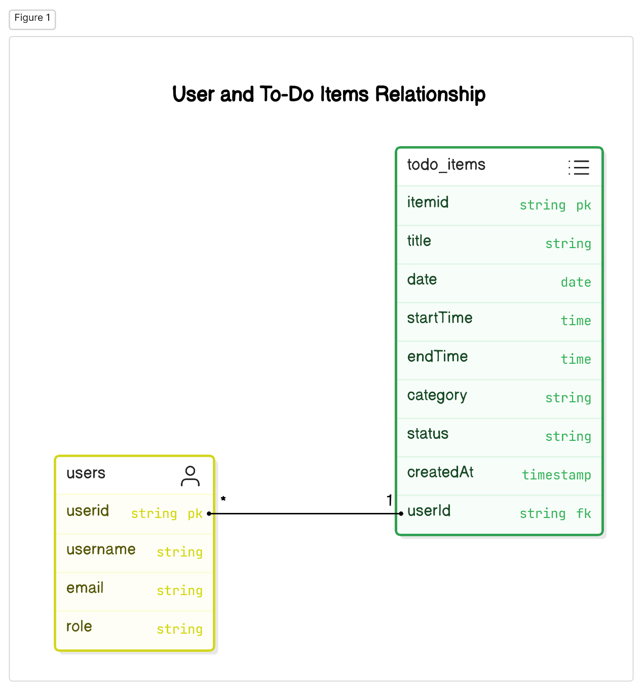

# Todo app
## Table of Contents
- [Introduction](#introduction)
- [Project Setup](#project-setup)
- [Prerequisites](#prerequisites)
- [System Architecture](#system-architecture)
- [Component Design](#component-design)
- [Data Design](#data-design)
- [Security Considerations](#security-considerations)
- [Performance Metrics](#performance-metrics)
- [User Interface Design](#user-interface-design)
- [API Documentation](#api-documentation)
- [Error Handling and Logging](#error-handling-and-logging)
- [Testing Strategy](#testing-strategy)
- [Deployment Plan](#deployment-plan)
- [Maintenance and Support](#maintenance-and-support)
- [Future Enhancements](#future-enhancements)

# Introduction
- Purpose: To serve as a user manual for the application
- Audience: Developers,users
- Scope: Overview of the project setup ,prerequistes, system architecture, data design, security, and testing strategies

# Project Setup
- **System Requirements:** Java 21, Maven 3.8.x, MySQL 8.x ,Web browser(Any),IDE (VS code,Intellij,Eclipse)
- **Installation:**
    1. Clone the repository: `git clone https://github.com/username/todo-app.git`
    2. Navigate to the project directory: `cd todo-app`
    3. Build the project: `mvn clean install`
    4. Run the application: `mvn spring-boot:run`
- **Configuration:** Modify `application.properties` for database connection details.

## Prerequisites
- Basic knowledge of Java and Spring Boot
- Familiarity with Thymeleaf for templating
- Understanding of spring security authentication mechanisms like BasicAuth

# System Architecture
- High-level overview of the system
- Diagram: System architecture flowchart
- Components:
    - Thymeleaf templates: guestHome, login, register, welcome, profile, archive
    - Spring Boot backend
    - Spring security for authentication (Basic-Auth)
# Component Design
- GuestHome: Public view for guests
- Login: User authentication
- Register: User registration
- Welcome: Post-login view displaying current to-do items
- Profile: User profile management
- Archive: Display all to-do items
- 
# ## Data Design
- High-level overview of data models
- **Entities:** User, ToDoItem
- **ERD:**
  

# Security Considerations
- Authentication mechanisms
- User login and registration security
# Performance Metrics
- Response time
- Load handling
# User Interface Design
- Mock-ups or wireframes for each view
# API Documentation
- Endpoints for user and to-do item management
# Error Handling and Logging
- Strategies for error handling
- Logging mechanisms
# Testing Strategy
- Unit testing: Methods and tools
- Integration testing: Methods and tools
# Deployment Plan
- Steps for deploying the application
- Environment setup
# Maintenance and Support
- Guidelines for maintaining and updating the system
- Support

